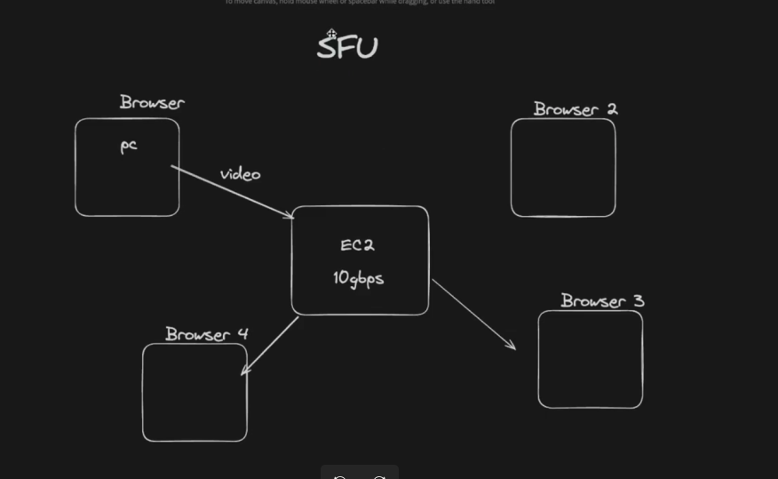
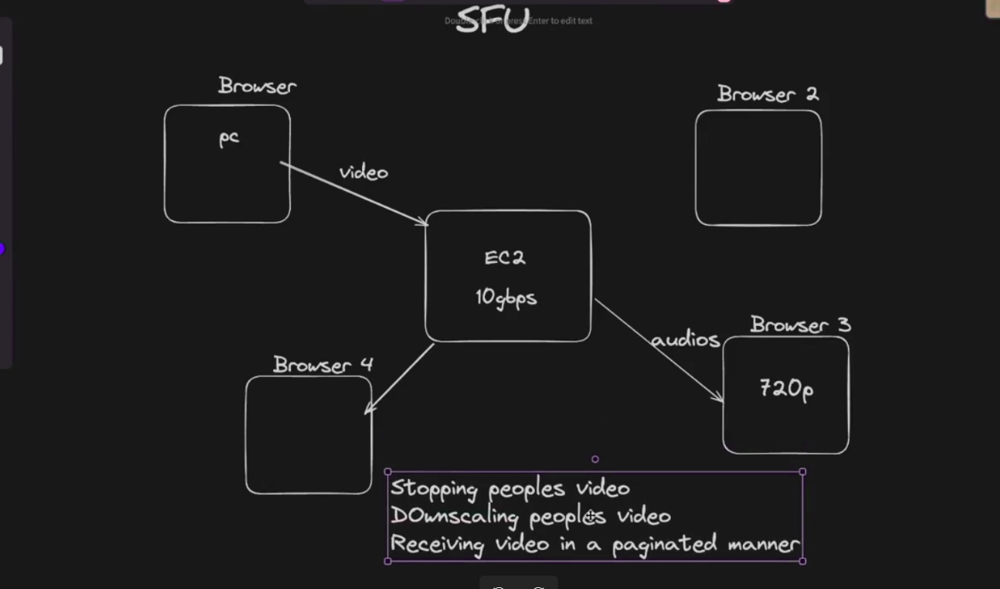
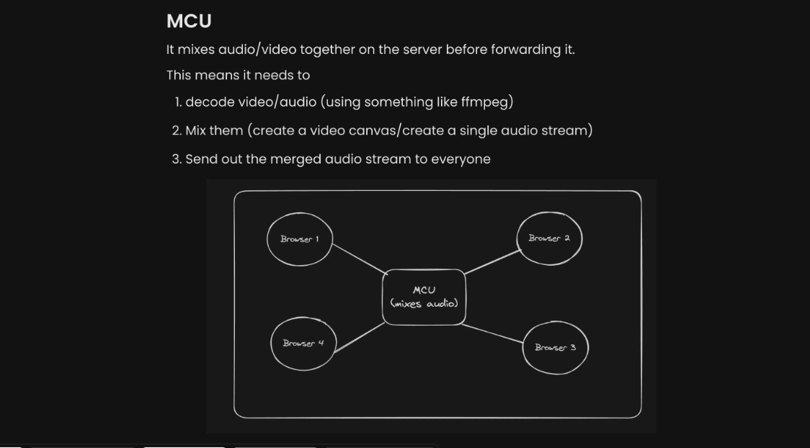
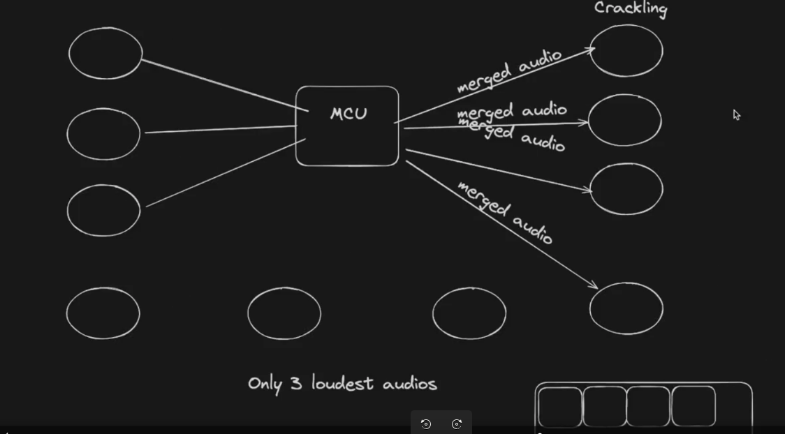

# WebRTC Architecture Overview

WebRTC (Web Real-Time Communication) enables real-time communication for voice, video, and data transfer directly between devices. Below is an overview of the key components of WebRTC and their roles in the architecture.
---

---
## Summary of Roles in WebRTC
| **Component**           | **Role**                                                                 |
|--------------------------|-------------------------------------------------------------------------|
| **P2P**                 | Establishes a direct connection between peers.                          |
| **Signaling Server**     | Exchanges setup information like SDP and ICE candidates.               |
| **STUN**                | Discovers public IP and port for NAT traversal.                         |
| **TURN**                | Acts as a relay when direct communication isn't possible.               |
| **SDP**                 | Defines session details like media codecs, transport, and connection info. |
| **SFU**                 | Receives and selectively forwards media streams to participants.         |
| **MCU**                 | Mixes media streams into one and sends it back to participants.          |

---

---
## Detailed Overview
---
## 1. Peer-to-Peer (P2P)
WebRTC establishes a **direct connection** between two peers (e.g., browsers or devices) for real-time communication.

### **How it Works**
- Peers exchange information such as IP addresses and media capabilities via a signaling mechanism.
- After negotiation, WebRTC uses protocols like **ICE**, **STUN**, or **TURN** to determine the best path for direct communication.

### **Advantages**
- **Low Latency**: Minimal delay due to the direct connection.
- **Efficiency**: No central server is required for data transfer after the connection is established.

### **Challenges**
- NAT (Network Address Translation) and firewalls can block direct communication, requiring additional mechanisms like STUN or TURN servers.

---

## 2. Signaling Server
The **signaling server** facilitates the exchange of connection setup information between peers before the WebRTC connection is established.

### **Role**
- Transmits **Session Description Protocol (SDP)** messages and **ICE candidate** information.
- Acts as a mediator during the initial connection setup phase.

### **Protocols Used**
- Commonly uses **WebSockets**, **HTTP**, or custom protocols.

### **Important Note**
- Signaling is **not part of the WebRTC standard**, so developers must implement it themselves.

---

## 3. STUN (Session Traversal Utilities for NAT)
A **STUN server** helps peers discover their public IP address and port when they are behind NAT or a firewall.

### **Purpose**
- Determines the external (public) address and port of a device.
- Enables direct communication by sharing this information with the other peer.

### **Use Case**
- Works well when the NAT is symmetric or port-restricted.

### **Example**
- A user behind a home router discovers their public IP address via a STUN server.

---

## 4. TURN (Traversal Using Relays Around NAT)
If direct communication is not possible due to restrictive NAT or firewalls, **TURN servers** act as relays.

### **Role**
- Relays all data between peers when a direct connection cannot be established.

### **Key Characteristics**
- Requires more bandwidth and is resource-intensive since all media traffic goes through the TURN server.

### **When to Use TURN**
- When both peers are behind restrictive NATs or firewalls.

---

## 5. SDP (Session Description Protocol)
**SDP** is a text-based protocol used to describe multimedia sessions during the WebRTC signaling process.

### **Purpose**
- Communicates information about media formats, codecs, and connection details between peers.

### **Contains**
- **Media types**: Audio, video, or data channels.
- **Supported codecs**: e.g., VP8, Opus.
- **Transport protocols**: ICE candidates, DTLS-SRTP details.

### **Key Steps**
1. One peer creates an **offer** (SDP).
2. The other peer responds with an **answer** (SDP).
3. This exchange establishes mutual agreement on connection parameters.

### **Example SDP Message**
```plaintext
v=0
o=- 46117320 2 IN IP4 127.0.0.1
s=-
t=0 0
m=audio 49170 RTP/AVP 0
c=IN IP4 203.0.113.1
a=rtpmap:0 PCMU/8000
```

---

## 6. SFU (Selective Forwarding Unit)
An **SFU** is a server that receives media streams from all participants and selectively forwards them to other participants.

### **How it Works**
- Each participant sends their media streams to the SFU.
- The SFU forwards only the required streams (e.g., active speaker video) to each participant, optimizing bandwidth usage.

### **Advantages**
- **Scalability**: Efficient for large group calls as it reduces the processing load on participants.
- **Flexibility**: Supports adaptive streaming by forwarding streams based on participants' bandwidth.

### **Challenges**
- Requires a central server (SFU), which increases infrastructure complexity.

### **Example Architecture**


---

## 7. MCU (Multipoint Control Unit)
An **MCU** is a server that receives media streams from all participants, mixes them into a single stream, and sends it back to each participant.

### **How it Works**
- Each participant sends their media streams to the MCU.
- The MCU processes and combines the streams into a single composite stream.

### **Advantages**
- **Simplified Client Logic**: Participants only need to handle one stream.
- **Customizable Layouts**: The MCU can create specific layouts (e.g., grid view for video).

### **Challenges**
- High server load: The MCU handles significant processing, making it expensive to scale.
- Increased latency: The mixing process introduces delays.

### **Example Architecture**



---


By leveraging these components, WebRTC provides efficient, secure, and reliable real-time communication across devices and networks.

